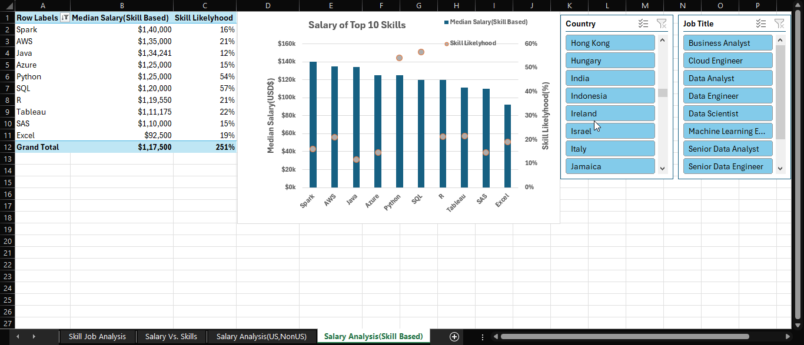

# Excel Projects

## 1. Data Analytics Jobs Dashboard

 
 This Excel project is an interactive dashboard that visualizes key insights about data analytics jobs. It includes:

- **Job Titles:** Overview of various data analytics roles.
- **Salaries:** Comparative salary analysis for different positions.
- **Top Countries:** Countries with the highest number of job opportunities.
- **Job Platforms:** Main platforms where these jobs are posted.
- **Job Counts:** Number of job listings per job title.
- **Job Schedule Type:** Breakdown of different job schedule in the analytics field.

  
  

The dashboard helps users quickly understand the current landscape of data analytics careers using clear charts and tables.

## 2.Data Analytics Jobs Dashboard Project 

## Data Jobs Salary Analysis Project  

This Excel project provides a comprehensive analysis of salaries and skills for various data-related jobs using multiple worksheets. The analysis is presented through pivot tables and interactive charts, offering insights such as:

- **Skill Likelihood:** Discover the most common skills required in data science roles, visualized with a bar chart.
- **Top Skills:** Identify the top skills (such as SQL, Python, Tableau, R, AWS, Excel, etc.) and their prevalence in job listings.
- **Country & Job Title Filters:** Easily filter data by country and job title to explore regional and role-specific trends.
- **Salary Analysis:** Compare median salaries based on skills, countries, and job titles.
- **Multiple Worksheets:** Includes dedicated sheets for skill-job analysis, salary vs. skills, US vs. Non-US salary analysis, and skill-based salary analysis.

This project helps users understand the relationship between skills, job titles, and salaries in the data industry, supporting informed career and hiring decisions.

 <!-- Replace 'dashboard.png' with your actual screenshot filename -->
