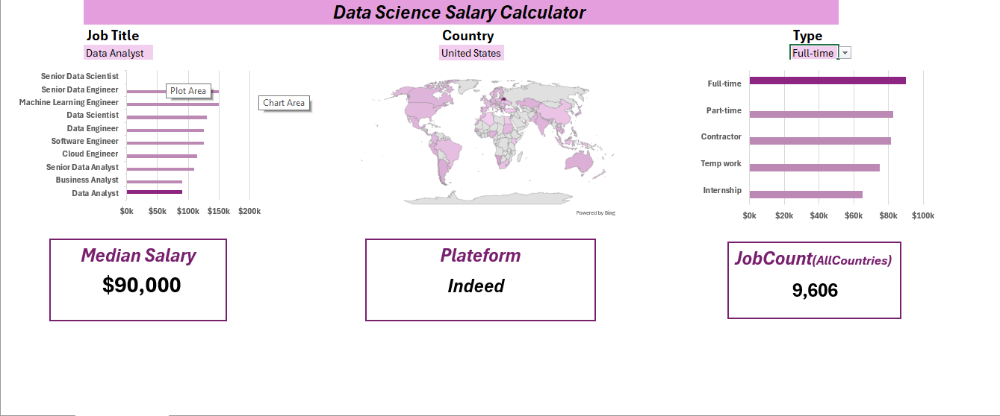

## Data Analytics Jobs Dashboard Project  

This Excel project is an interactive dashboard that visualizes key insights about data analytics jobs. It includes:

- **Job Titles:** Overview of various data analytics roles.
- **Salaries:** Comparative salary analysis for different positions.
- **Top Countries:** Countries with the highest number of job opportunities.
- **Job Platforms:** Main platforms where these jobs are posted.
- **Job Counts:** Number of job listings per job title.
- **Job Schedule Type:** Breakdown of different job schedule in the analytics field.

The dashboard helps users quickly understand the current landscape of data analytics careers using clear charts and tables.

